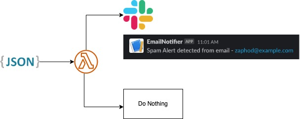

# Email Notifier

## Architecture



1. Get Slack Webhook URL
2. Setup Lambda to filter payload, send to Slack Webhook URL if it's spam.
3. Setup Lambda Function URL that allows POST request method

## Demo

https://user-images.githubusercontent.com/55923773/222775681-0ce6ace7-253b-4491-907a-6728b1436df2.mp4

## Walkthrough

https://user-images.githubusercontent.com/55923773/222775635-ad7d9d9e-be12-47b9-bde2-87893f093b96.mp4

## Prerequisite

- AWS Account with Lambda access
- Slack channel & Webhook URL

## Deployment

> For any doubts, watch the 2-min walkthrough above.

1. [Create Slack App with Incoming Webhook](https://api.slack.com/messaging/webhooks#:~:text=Incoming%20Webhooks%20are%20a%20simple,make%20the%20messages%20stand%20out). and retrieve a Slack webhook URL like `https://hooks.slack.com/services/<token>`
2. Create a Lambda function from AWS with ruby template, copy and paste the code from [lambda_function.rb](./lambda_function.rb)
3. Extract Slack webhook token as an environment_variable named `slack_webhook_token`, for instance it should look similar like `aaa/ccc/bbbb`
4. Setup Lambda Function URL that allows POST request (Lambda Function -> Configuration -> Function URL tab)
5. Test as followed:

```sh
# Spam Payload
curl -X POST \
-d '{"RecordType":"Bounce","Type":"SpamNotification","TypeCode":512,"Name":"Spam notification","Tag":"","MessageStream":"outbound","Description":"The message was delivered, but was either blocked by the user, or classified as spam, bulk mail, or had rejected content.","Email":"zaphod@example.com","From":"notifications@honeybadger.io","BouncedAt":"2023-02-27T21:41:30Z"}' \
-H 'content-type: application/json' \
--url "<Lambda Function URL>"
```

```sh
# Not Spam Payload
curl -X POST \
-d '{"RecordType":"Bounce","MessageStream":"outbound","Type":"HardBounce","TypeCode":1,"Name":"Hard bounce","Tag":"Test","Description":"The server was unable to deliver your message (ex: unknown user, mailbox not found).","Email":"arthur@example.com","From":"notifications@honeybadger.io","BouncedAt":"2019-11-05T16:33:54.9070259Z"}' \
-H 'content-type: application/json' \
--url "<Lambda Function URL>"
```